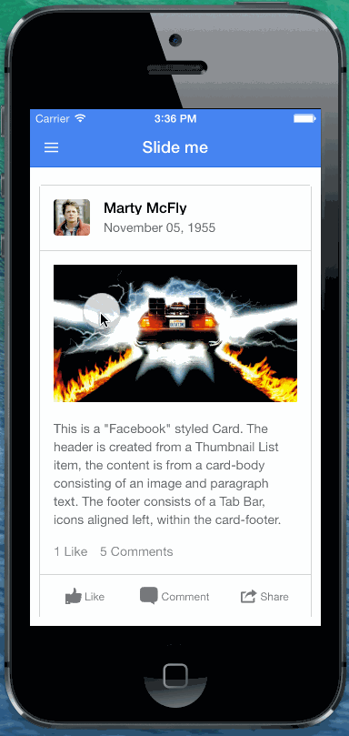

iOS 7 Fading Header Effect with Ionic and AngularJS
====

  

    
  

  

    

      The fading header is a new addition to the mobile landscape now that iOS 7 lets apps "bleed into" the status bar area that was previously off limits.
    

    

      To achieve this effect, we will use a transparent rectangle that will set behind the real status bar, fading it in and out as we drag the content
      area of the side menu controller.
    

    

      This rectangle will react to the changes in the center content position and slowly fade itself in. We use a custom AngularJS directive for this.
    

    <h3>Side Menu Layout</h3>
    

      To start, we need to set up an app with a side menu controller:



<body ng-app="starter">
  

    <ion-side-menus>
      <ion-pane ion-side-menu-content>
        <header class="bar bar-header bar-positive">
          <button class="button button-icon" ng-click="openLeft()"><i class="icon ion-navicon"></i></button>
          <h1 class="title">Slide me</h1>
        </header>
        <ion-content has-header="true" padding="true">
          <!-- Center content -->
        </ion-content>
      </ion-pane>
      <ion-side-menu side="left">
        <header class="bar bar-header bar-dark" fade-header>
          <h1 class="title">Left</h1>
        </header>
        <ion-content has-header="true">
        </ion-content>
      </ion-side-menu>
    </ion-side-menus>
  

</body>



    

    

      <h3>Fade bar</h3>
      

        Now, we will need to add our status bar fading rectangle. To do this, we will create a new directive called <code>&lt;fade-bar&gt;</code> that will sit right inside the ion-side-menus directive in order to receive scope data as the content is moved left and right.
      

      

        Go ahead and add a fade-bar element right inside of the ion-side-menus directive:
      


<body ng-app="starter">
  

    <ion-side-menus>
      <!-- Our new directive -->
      <fade-bar></fade-bar>

      

        The directive replaces itself into a simple div with the <code>fade-bar</code> class. We need to set up the CSS for this bar first:
      

      


.fade-bar {
  height: 20px;
  width: 100%;
  position: fixed;
  z-index: 9999;
  opacity: 0;
  background-color: #000;
}

      

      

        We can put this CSS anywhere, including a simple &lt;style&gt; tag in the header.
      

      

        Now we need to implement the custom directive which will listen for changes to the side menu content area as it is
        dragged, and fade in or out the status bar we've added:
      



angular.module('starter', ['ionic'])

.controller('MenuCtrl', function($scope) {
  // Our controller
})

// The fadeBar directive
.directive('fadeBar', function($timeout) {
  return {
    restrict: 'E',
    template: '

',
    replace: true,
    link: function($scope, $element, $attr) {
      // Run in the next scope digest
      $timeout(function() {
        // Watch for changes to the openRatio which is a value between 0 and 1 that says how "open" the side menu is
        $scope.$watch('sideMenuController.getOpenRatio()', function(ratio) {
          // Set the transparency of the fade bar
          $element[0].style.opacity = Math.abs(ratio);
        });
      });
    }
  }
});
  </body>
</html>


    <h3>That's it!</h3>
    

      If all the pieces were done correctly, you should now have a simple fading status bar in your app.
    

    

      Of course, it's never so easy, so we've supplied a fully working demo that you can try out or copy and paste into your own projects:
    

    

      <a href="https://github.com/driftyco/ionic-tutorial-status-fade" class="btn btn-primary">Get code</a>
    

  

