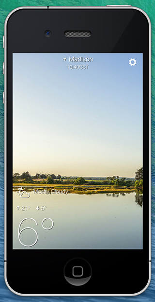

Fullscreen apps on iOS
====

  

    
    

      <i>Screenshot from our <a href="https://github.com/driftyco/ionic-weather/">Ionic Weather</a> app</i>
    

  

  

    

      Many apps (not just games!) benefit from a fullscreen experience on the phone, and making your apps
      fullscreen in Ionic is simple!
    

    

      First, we need to note this only works on Cordova (recommend v{{ site.recommended_cordova_version }}) or another native UIWebView wrapper. If we use Cordova,
      we will need to install one plugin:
    

    

<code>
$ cordova plugin add org.apache.cordova.statusbar
</code>
    

    

      Then, we will use Ionic's <code>Platform</code> service to listen for the device ready event and remove the status bar:
    

    



angular.module('myApp', ['ionic'])

.controller('MyCtrl', function($scope) {
  ionic.Platform.ready(function() {
    // hide the status bar using the StatusBar plugin
    StatusBar.hide();
  });
});


    

    

      Which might correspond to the following HTML:
    

    


      <body ng-controller="MyCtrl">
      </body>

    

    

      That's it! You've got your fullscreen app and you are now ready for party time.
    

  

