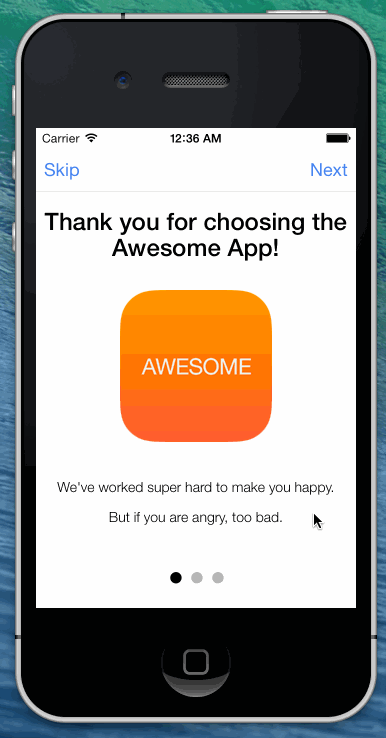

<!---->

  

    
    

    <h2 class="underline">Building a User Tutorial with Ionic</h2>
    
    

      A popular pattern for mobile apps is the initial-load user tutorial. This is a mutli-screen
      tutorial that shows when the user first opens the app, and helps them learn how to use the app.
    

    

      The tutorial uses a slide box that the user can swipe through as they please. The point is that you are introducing them
      to the app and trying to give them a running start when your main interface loads.
    

    

      Try playing with the demo on the left. You'll notice you can drag and swipe between different pages of the tutorial (it also works with
      the mouse for testing). You can also switch pages using header buttons and skip the entire tutorial or complete it with the header buttons.
    

    

      To build this tutorial, we will be using the <a href="/docs/angularjs/views/slide-box">Slide Box</a> view and the <a href="/docs/angularjs/controllers/nav-router">Nav Router</a>. To start a new Ionic project, we can use the Ionic <a href="/docs/#starter">command line utility</a>, or clone the <a href="https://github.com/driftyco/ionic-angular-cordova-seed">seed project</a> or <a href="http://codepen.io/ionic/pen/AjgEB">codepen sample</a>.
    

    

      To start, we will set our app up to use Nav Routing, so that we can navigate to the main interface of the app once the tutorial is complete. Inside of the <code>&lt;body&gt;</code> tag, add this code:
    

    


<body ng-app="myApp">

  <!-- Our navigation router with some animations set -->
  <pane nav-router animation="slide-left-right-ios7">
    <!-- The nav bar that will be updated as we navigate -->
    <nav-bar class="nav-title-slide-ios7" type="bar-default" back-button-type="button-icon" back-button-icon="icon ion-arrow-left-c"></nav-bar>

    <!-- where the content of each page will be rendered -->
    <ng-view></ng-view>
  </pane>
</body>

    

    

      For the nav router, we are using the standard <a href="http://docs.angularjs.org/api/ngRoute">ngRoute</a> module from AngularJS that will insert each view of the 
      app based on the URL triggered into the <code>&lt;ng-view&gt;</code> element.
    

    

      Since <code>ngRoute</code> needs some URL mappings and a template to load for each one, we need to set those up in our Javascript:
    

    


angular.module('myApp', ['ionic', 'ngRoute'])

.config(function ($compileProvider){
  // Set the whitelist for certain URLs just to be safe
  $compileProvider.aHrefSanitizationWhitelist(/^\s*(https?|ftp|mailto|file|tel):/);
})

.config(function($routeProvider, $locationProvider) {
  // Set up the initial routes that our app will respond to.
  // These are then tied up to our nav router which animates and
  // updates a navigation bar
  $routeProvider.when('/', {
    templateUrl: 'intro.html',
    controller: 'AppCtrl'
  });

  $routeProvider.when('/main', {
    templateUrl: 'main.html',
    controller: 'MainCtrl'
  });

  // if none of the above routes are met, use this fallback
  // which executes the 'AppCtrl' controller (controllers.js)
  $routeProvider.otherwise({
    redirectTo: '/'
  });
});

    

    

      This tells <code>ngRoute</code> to load the <code>intro.html</code> template when the user is on the root or <code>/</code> URL, and the <code>main.html</code> template when the user
      hits the <code>/main</code> URL.
    

    <h2>Intro Template</h2>
    

      For the <code>intro.html</code> template, we will use a slide box:
    

    




    

    

      In this template, we've created a page that will show our multi-slide tutorial.
    

    

      In the routes, we configured this template to use the <code>IntroCtrl</code> controller. We need this controller to update the navigation bar as the user
      progresses through the tutorial, and to navigate to the main app interface once the tutorial is done. Let's add the logic for the controller now, right after the
      main Javascript code above:
    

    


})

.controller('IntroCtrl', function($scope, $location) {
  // Called to navigate to the main app
  var startApp = function() {
    $location.path('/main');

    // Set a flag that we finished the tutorial
    window.localStorage['didTutorial'] = true;
  };

  // Check if the user already did the tutorial and skip it if so
  if(window.localStorage['didTutorial'] === "true") {
    startApp();
    return;
  }

  // Move to the next slide
  $scope.next = function() {
    $scope.$broadcast('slideBox.nextSlide');
  };

  // Our initial right buttons
  var rightButtons = [
    {
      content: 'Next',
      type: 'button-positive button-clear',
      tap: function(e) {
        // Go to the next slide on tap
        $scope.next();
      }
    }
  ];
  
  // Our initial left buttons
  var leftButtons = [
    {
      content: 'Skip',
      type: 'button-positive button-clear',
      tap: function(e) {
        // Start the app on tap
        startApp();
      }
    }
  ];

  // Bind the left and right buttons to the scope
  $scope.leftButtons = leftButtons;
  $scope.rightButtons = rightButtons;

  // Called each time the slide changes
  $scope.slideChanged = function(index) {

    // Check if we should update the left buttons
    if(index > 0) {
      // If this is not the first slide, give it a back button
      $scope.leftButtons = [
        {
          content: 'Back',
          type: 'button-positive button-clear',
          tap: function(e) {
            // Move to the previous slide
            $scope.$broadcast('slideBox.prevSlide');
          }
        }
      ];
    } else {
      // This is the first slide, use the default left buttons
      $scope.leftButtons = leftButtons;
    }
    
    // If this is the last slide, set the right button to
    // move to the app
    if(index == 2) {
      $scope.rightButtons = [
        {
          content: 'Start using MyApp',
          type: 'button-positive button-clear',
          tap: function(e) {
            startApp();
          }
        }
      ];
    } else {
      // Otherwise, use the default buttons
      $scope.rightButtons = rightButtons;
    }
  };
})

    

    

      It's kind of a lot of code, bu the gist is that we are setting the left and right buttons for the nav bar. When we move through the slider and 
      <code>$scope.slideChanged</code> is called, we update the nav bar buttons depending on which slide we are on.
    

    

      We also check to see if the user already finished the tutorial at one point, which will be indicated by a <code>"didTutorial"</code> value in local storage.
    

    

      When we are done with the tutorial, we call <code>startApp()</code> which calls <code>$location.path('/main')</code> to navigate to the main
      app interface. We also set the flag in local storage indicating the user finished the tutorial.
    

    <h2 class="underline">Styling</h2>
    

      Now that we have a working demo, we just need a little CSS to make the slides look the way we want:
    

    


.slider {
  height: 100%;
}
.slider-slide {
  padding-top: 80px;
  color: #000;
  background-color: #fff;
  text-align: center;

  font-family: "HelveticaNeue-Light", "Helvetica Neue Light", "Helvetica Neue", Helvetica, Arial, "Lucida Grande", sans-serif; 
  font-weight: 300;
}

#logo {
  margin: 30px 0px;
}

#list {
  width: 170px;
  margin: 30px auto;
  font-size: 20px;
}
#list ol {
  margin-top: 30px;
}
#list ol li {
  text-align: left;
  list-style: decimal;
  margin: 10px 0px;
}

    

    

And that's it! You now have a nice intro tutorial for your users!
    

    

      <a href="http://forum.ionicframework.com/t/new-tutorial-swipeable-user-intro-tutorial/278">Discuss this tutorial on the forum</a>
    

  

